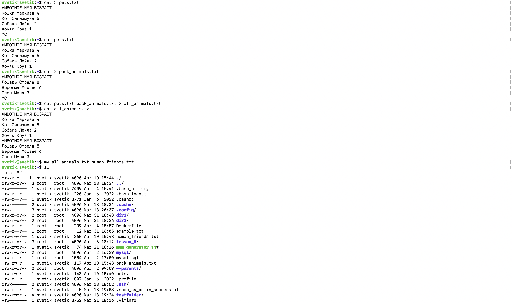
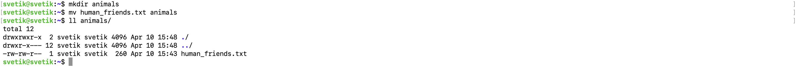
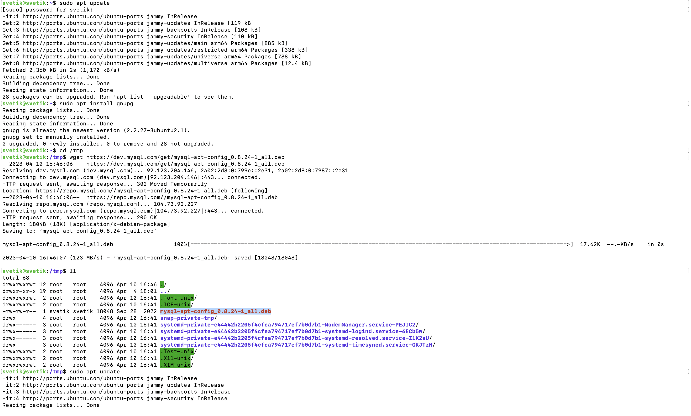
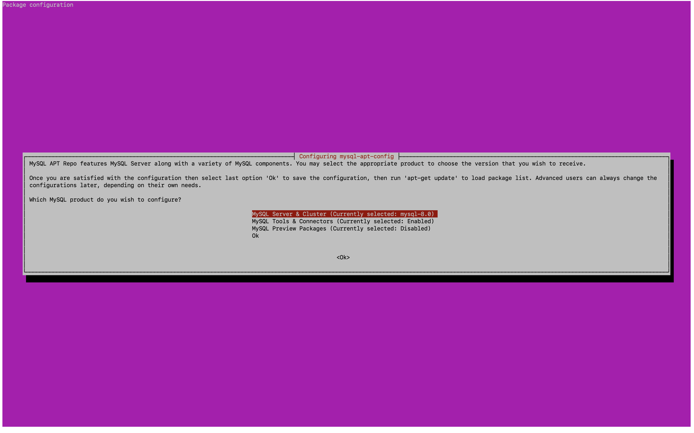
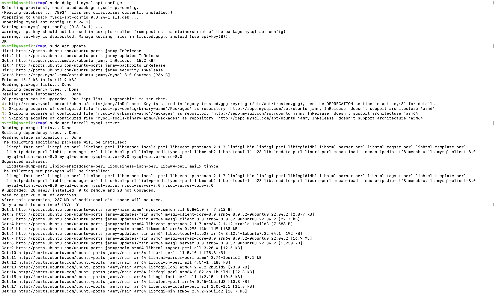
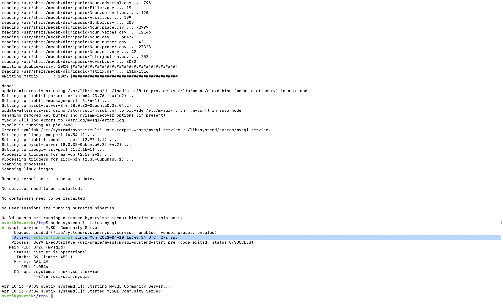
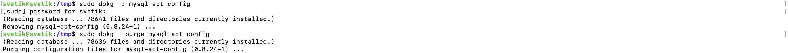
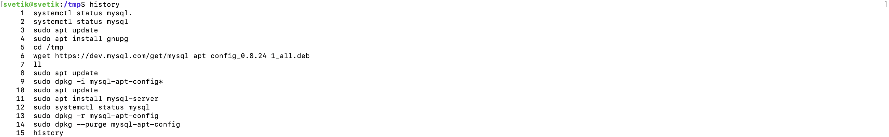

# Итоговая аттестация

### Организуйте систему учёта для питомника, в котором живут домашние и вьючные животные.

1. Используя команду cat в терминале операционной системы Linux, создать два файла 
    Домашние животные (заполнив файл собаками, кошками, хомяками) и Вьючные животными
    заполнив файл Лошадьми, верблюдами и ослы), а затем объединить их. 
    ```shell
        $ cat > pets.txt
        $ cat > pack_animals.txt
        $ cat pets.txt pack_animals.txt > all_animals.txt
    ```

    Просмотреть содержимое созданного файла. Переименовать файл, дав ему новое имя (Друзья человека).

    ```shell
        $ cat all_animals.txt
        $ mv all_animals.txt human_friends.txt
    ```
    

2. Создать директорию, переместить файл туда
    ```shell
        $ mkdir animals
        $ mv human_friends.txt animals
    ```
    
    
3. Подключить дополнительный репозиторий MySQL. Установить любой пакет
   из этого репозитория.
    ```shell
        $ sudo apt update
        $ sudo apt install gnupg
        $ cd /tmp
        $ wget https://dev.mysql.com/get/mysql-apt-config_0.8.24-1_all.deb
        $ ll
        $ sudo dpkg -i mysql-apt-config*
        $ sudo apt update
        $ sudo apt install mysql-server
        $ sudo systemctl status mysql
    ```
    
    
    
    

4. Установить и удалить deb-пакет с помощью dpkg.

   ```shell
      $ sudo dpkg -i mysql-apt-config_0.8.24-1_all.deb
      $ sudo dpkg -r mysql-apt-config
      $ sudo dpkg --purge mysql-apt-config
   ```
   
 
5. Выложить историю команд в терминале ubuntu
   ```shell
      $ history
   ```
   
   
