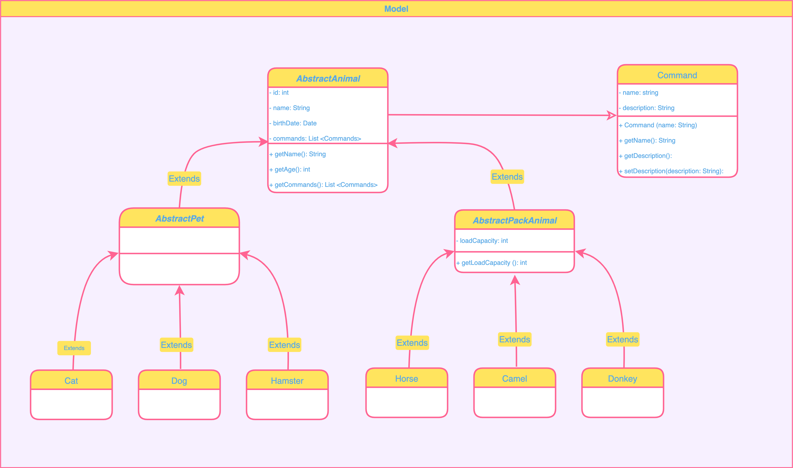

# Итоговая аттестация

### Организуйте систему учёта для питомника, в котором живут домашние и вьючные животные.

1. Используя команду cat в терминале операционной системы Linux, создать два файла 
    Домашние животные (заполнив файл собаками, кошками, хомяками) и Вьючные животными
    заполнив файл Лошадьми, верблюдами и ослы), а затем объединить их. 
    ```shell
        $ cat > pets.txt
        $ cat > pack_animals.txt
        $ cat pets.txt pack_animals.txt > all_animals.txt
    ```

    Просмотреть содержимое созданного файла. Переименовать файл, дав ему новое имя (Друзья человека).

    ```shell
        $ cat all_animals.txt
        $ mv all_animals.txt human_friends.txt
    ```
    

2. Создать директорию, переместить файл туда
    ```shell
        $ mkdir animals
        $ mv human_friends.txt animals
    ```
    
    
3. Подключить дополнительный репозиторий MySQL. Установить любой пакет
   из этого репозитория.
    ```shell
        $ sudo apt update
        $ sudo apt install gnupg
        $ cd /tmp
        $ wget https://dev.mysql.com/get/mysql-apt-config_0.8.24-1_all.deb
        $ ll
        $ sudo dpkg -i mysql-apt-config*
        $ sudo apt update
        $ sudo apt install mysql-server
        $ sudo systemctl status mysql
    ```
    
    
    
    

4. Установить и удалить deb-пакет с помощью dpkg.

   ```shell
      $ sudo dpkg -i mysql-apt-config_0.8.24-1_all.deb
      $ sudo dpkg -r mysql-apt-config
      $ sudo dpkg --purge mysql-apt-config
   ```
   
 
5. Выложить историю команд в терминале ubuntu
   ```shell
      $ history
   ```
   
   
6. Нарисовать диаграмму, в которой есть класс родительский класс, домашние животные и вьючные животные, в составы которых в случае домашних животных войдут классы: собаки, кошки, хомяки, а в класс вьючные животные войдут: Лошади, верблюды и ослы).
   

7. В подключенном MySQL репозитории создать базу данных “Друзья человека”
```sql
DROP DATABASE IF EXISTS human_friends;
CREATE DATABASE human_friends;
USE human_friends;
```

8. Создать таблицы с иерархией из диаграммы в БД
```sql
DROP TABLE IF EXISTS commands;
CREATE TABLE commands
(
    id INT PRIMARY KEY NOT NULL AUTO_INCREMENT,
    name varchar(30),
    description varchar(255)
);

DROP TABLE IF EXISTS animals_group;
CREATE TABLE animals_group
(
    id INT PRIMARY KEY NOT NULL AUTO_INCREMENT,
    name varchar(30)
);

DROP TABLE IF EXISTS animal_genius;
CREATE TABLE animal_genius
(
    id INT PRIMARY KEY NOT NULL AUTO_INCREMENT,
    name varchar(30),
    group_id INT,
    FOREIGN KEY (group_id) REFERENCES animals_group (id)
    ON DELETE CASCADE ON UPDATE CASCADE
);

DROP TABLE IF EXISTS nursery_animal;
CREATE TABLE nursery_animal
(
    id INT PRIMARY KEY NOT NULL AUTO_INCREMENT,
    name varchar(30),
    birth_date DATE,
    genius_id INT,
    FOREIGN KEY (genius_id) REFERENCES animal_genius (id)
    ON DELETE CASCADE ON UPDATE CASCADE
);

DROP TABLE IF EXISTS animal_commands;
CREATE TABLE animal_commands
(
    animal_id INT NOT NULL,
    command_id INT NOT NULL,

    PRIMARY KEY (animal_id, command_id),
    FOREIGN KEY (animal_id) REFERENCES nursery_animal (id)
     ON DELETE CASCADE ON UPDATE CASCADE,
    FOREIGN KEY (command_id) REFERENCES commands (id)
     ON DELETE CASCADE  ON UPDATE CASCADE
);
```

9. Заполнить низкоуровневые таблицы именами(животных), командами которые они выполняют и датами рождения
```sql
INSERT INTO commands(name)
VALUES
	 ('Поймать мышь'),
	 ('Сальто'),
	 ('Прыжок'),
	 ('Лечебный Ур-Ур-Ур'),
	 ('Плеваться далеко');

INSERT INTO animals_group (name)
VALUES
	 ('Вьючные животные'),
	 ('Домашние животные');

INSERT INTO animal_genius (name, group_id)
VALUES
	 ('Кошка', 2),
	 ('Собака', 2),
	 ('Хомяк', 2),
	 ('Лошадь', 1),
	 ('Осел', 1),
	 ('Верблюд', 1);

INSERT INTO nursery_animal (name, birth_date, genius_id)
VALUES
	 ('Герда', '2022-05-20', 1),
	 ('Мильва', '2022-12-01', 2),
	 ('Плотва', '2022-07-12', 4),
	 ('Осел', '2021-02-04', 5),
	 ('Сухарик', '2023-01-24', 6),
	 ('Хома', '2022-12-20', 3),
	 ('Матрона', '2020-08-24', 1);

INSERT INTO animal_commands (animal_id, command_id)
VALUES
	 (1, 1), (1, 4), (2, 1), (2, 4),
	 (3, 3), (4, 3), (5, 5), (6, 2),
	 (7, 1), (7, 4);
```

10. Удалить из таблицы верблюдов, т.к. верблюдов решили перевезти в другой питомник на зимовку. Объединить таблицы лошади, и ослы в одну таблицу.
```sql
DELETE FROM nursery_animal WHERE genius_id = 5;

CREATE TABLE horse_donkey AS
SELECT * from nursery_animal WHERE genius_id = 4
UNION
SELECT * from nursery_animal WHERE genius_id = 5;
```

11. Создать новую таблицу “молодые животные” в которую попадут все животные старше 1 года, но младше 3 лет и в отдельном столбце с точностью до месяца подсчитать возраст животных в новой таблице
```sql  
CREATE TABLE young_animals AS
SELECT id, name, birth_date, 
datediff(curdate(),birth_date) DIV 31 as age, genius_id 
from nursery_animal 
WHERE date_add(birth_date, INTERVAL 1 YEAR) < curdate() 
AND date_add(birth_date, INTERVAL 3 YEAR) > curdate();
```
           
12. Объединить все таблицы в одну, при этом сохраняя поля, указывающие на прошлую принадлежность к старым таблицам.
```sql
SELECT id, name, birth_date, genius_id FROM horse_donkey
UNION
SELECT id, name, birth_date, genius_id FROM young_animals;
```
